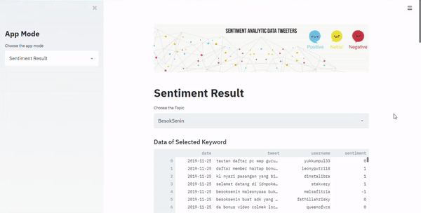

# Sentiment App With Python

This application can scraping tweets from Twitter, and label each tweet and do sentiment analytics, then display the wordcloud for each sentiment

## Scarping Page


## Sentiment Page


## Instaling Setup
Following this step to run the app :

- Clone this repo
- Create a virtual environment inside the folder
- Installing all requirements library using this command 
  ```
  pip install -r requirements.txt
  ```
- Install Mongodb
- Create a database called **sentimentdb** and create two collections called **tweets** and **keywords**
- And App is ready to running, hit this command
  ```
  streamlit run src/app.py
  ```

## Libraries
Some of the main libraries that are used in this application :

- [Twint](https://github.com/twintproject/twint)
- [Streamlit](https://streamlit.io/)
- [TextBlob](https://textblob.readthedocs.io/en/dev/)